# RoomGig App — Technical Diagrams

This document contains high-level diagrams for the RoomGig React Native / Expo real-estate application.

---

## 1. Architecture Overview

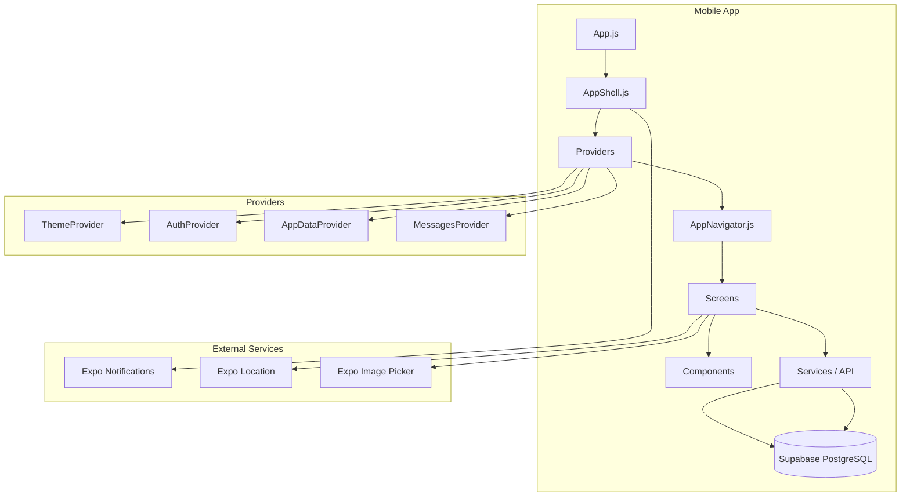

---

## 2. App Bootstrap Flow

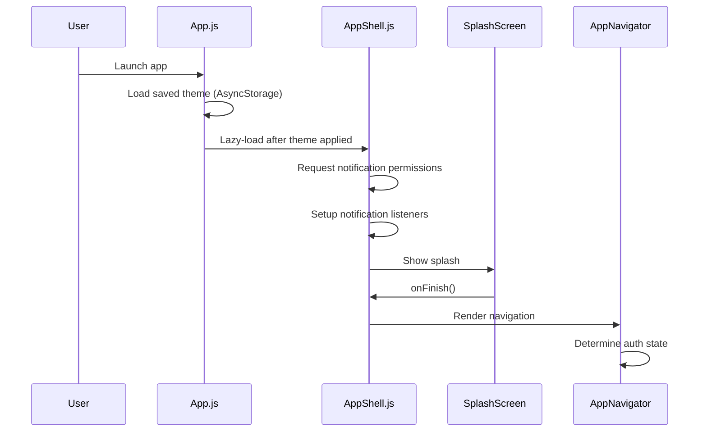

---

## 3. Provider Hierarchy

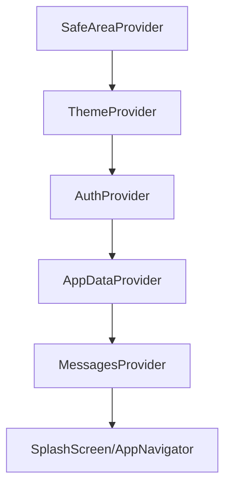

---

## 4. Navigation Structure

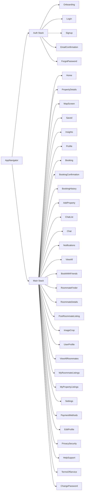

---

## 5. React Context Data Flow

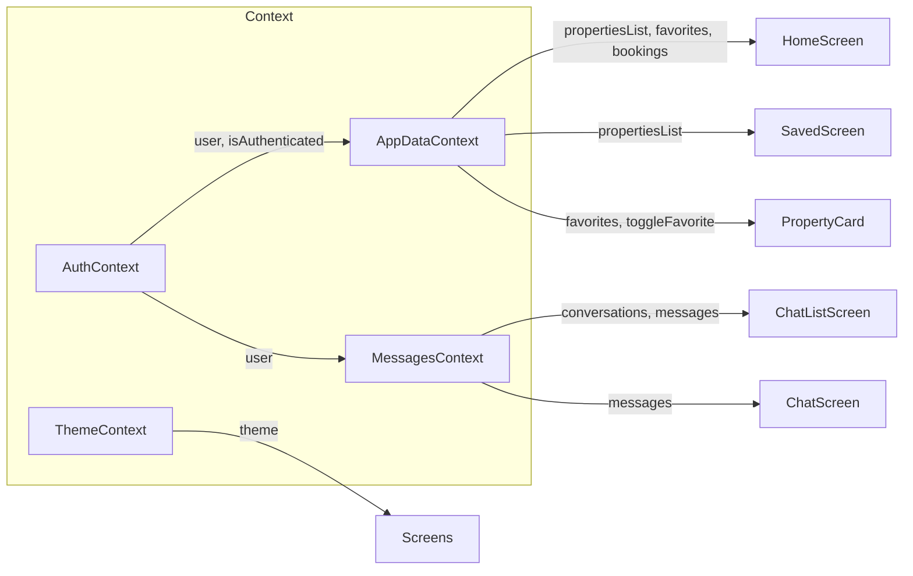

---

## 6. Database Entity Relationship Diagram

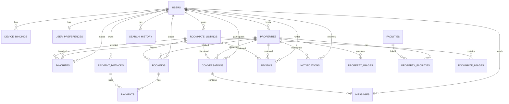

---

## 7. Property Listing Flow

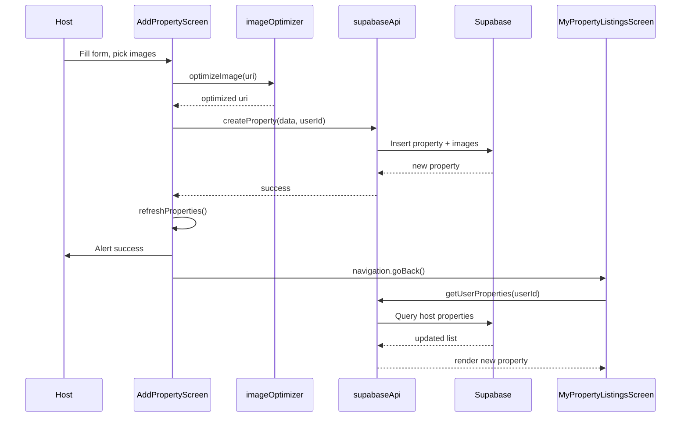

---

ALTER TABLE public.roommate_listings
ADD COLUMN IF NOT EXISTS preferences TEXT[] DEFAULT '{}',
ADD COLUMN IF NOT EXISTS amenities TEXT[] DEFAULT '{}';
```

---

## 9. Messaging Flow

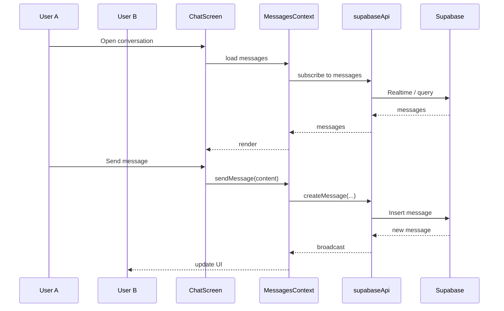

---

## 10. Authentication Flow

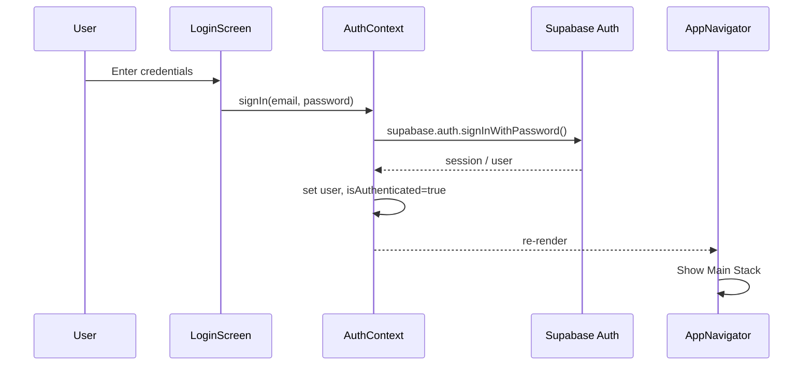

---

## 11. Screen-to-Component Hierarchy

```mermaid
graph TD
    HomeScreen --> SearchBar
    HomeScreen --> PropertyCard
    HomeScreen --> FilterButton
    HomeScreen --> FilterModal
    HomeScreen --> BottomNavBar

    PropertyDetailsScreen --> ImageCarousel
    PropertyDetailsScreen --> PropertyCard

    RoommateFinderScreen --> PropertyCard
    RoommateFinderScreen --> FilterButton
    RoommateFinderScreen --> SearchBar
    RoommateFinderScreen --> BottomNavBar

    ChatListScreen --> ChatItemSkeleton
    ChatListScreen --> EmptyState
    ChatListScreen --> BottomNavBar

    MyPropertyListingsScreen --> PropertyCard
    MyPropertyListingsScreen --> EmptyState

    AddPropertyScreen --> ErrorState
    AddPropertyScreen --> MapView

    ProfileScreen --> ProfileCompletionModal
```

---

## 12. Directory Structure

```
roomgig/
├── App.js                     # Entry point, theme hydration
├── index.js                   # Expo entry
├── app.json / eas.json        # Expo config
├── package.json
├── database/
│   ├── schema.sql             # Full PostgreSQL schema
│   └── seed_data.sql
├── supabase/
│   └── migrations/              # Supabase migrations
├── scripts/
│   ├── add-property.js
│   ├── add-user.js
│   └── run-seed.js
├── assets/
│   └── images & icons
└── src/
    ├── AppShell.js            # Providers + splash + navigator
    ├── navigation/
    │   └── AppNavigator.js    # React Navigation stack
    ├── context/
    │   ├── AuthContext.js
    │   ├── AppDataContext.js
    │   ├── MessagesContext.js
    │   └── ThemeContext.js
    ├── screens/               # 37 screens
    ├── components/            # Shared UI components
    ├── services/
    │   ├── supabaseApi.js     # API wrappers
    │   └── notificationService.js
    ├── utils/
    │   ├── supabase.js        # Supabase client
    │   ├── imageOptimizer.js
    │   ├── imagePreloader.js
    │   └── filterProperties.js
    ├── constants/
    │   └── colors.js
    └── data/
        └── mockData.js
```

---

## 13. Data Sync Pattern

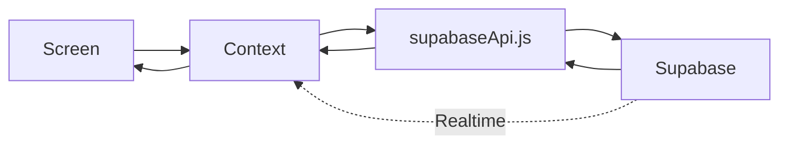

---

## 14. State Management Summary

| Layer | Responsibility |
|-------|--------------|
| `AuthContext` | Authentication state, user, onboarding status |
| `AppDataContext` | Properties, favorites, bookings global cache |
| `MessagesContext` | Conversations and messages |
| `ThemeContext` | Light / dark / system theme |
| Screen state | Form inputs, modals, local UI state |

